# Diagrama de Clases - MDDocumentEditor V2

## Arquitectura Completa con StateManager y Services

```mermaid
classDiagram
    %% ============================================================================
    %% CAPA DE DOMINIO - Modelo de Documento Markdown
    %% ============================================================================

    class MD_LINE_TYPE {
        <<enumeration>>
        +TEXT
        +TITLE
        +HEAD_TITLE
        +UNDERLINE_TITLE
        +SEPARATOR
        +LIST
        +ORDER_LIST
        +TASK
        +TODO
        +TABLE
        +BLOCKQUOTE
        +IMAGEN
        +CODE
        +START_CODE
        +END_CODE
    }

    class MDLine {
        +MD_LINE_TYPE type
        +str md_text
        +int num_line
        +MDLine prev_line
        +MDLine next_line
        +TranslateMarkdownToKVMarkup translate_markup
        +get_tab_level() int
        +get_title_level() int
        +get_title_Childs() List~MDLine~
        +get_title_first_child() MDLine
        +get_title_parent() MDLine
        +get_title_prev_same_level() MDLine
        +get_title_next_same_level() MDLine
        +get_title_prev() MDLine
        +get_title_next() MDLine
        +get_list_Childs() List~MDLine~
        +get_list_parent() MDLine
        +get_list_prev() MDLine
        +get_list_next() MDLine
        +get_markup_text(extensions) str
        +update_type() MD_LINE_TYPE
        +on_type(instance, new_type)
        +on_txt_change(instance, value)
        +on_num_line(instance, value)
    }

    class MDDocument {
        +str document
        +str path_doc
        +str doc_name
        -List~MDLine~ _md_lines
        +load_doc(path, doc_name) bool
        +save_doc() bool
        +save_as_doc(path, doc_name)
        +separate_lines() bool
        +join_lines() bool
        +get_first_title() MDLine
        +append_line(md_text_line) MDLine
        +append_lines(md_text_lines) bool
        +insert_line(id_line, md_text_line) MDLine
        +insert_lines(id_line, md_text_lines) bool
        +remove_line(md_line) bool
        +remove_lines(md_lines) bool
        +clear_lines()
        +move_line_up(md_line)
        +move_line_down(md_line)
        +update_type_line(md_line)
        +get_markup_text(extensions) str
    }

    %% ============================================================================
    %% CAPA DE ESTADO - StateManager Pattern
    %% ============================================================================

    class LineState {
        <<dataclass frozen>>
        +int index
        +bool selected
        +bool active
        +bool editing
        +bool hotlight
        +bool visible
        +Tuple cursor_pos
        +bool show_number_line
        +bool show_tree
        +bool show_infobar
        +float alpha_background
        +with_changes(**kwargs) LineState
        +__repr__() str
    }

    class StateChangeEvent {
        +int index
        +LineState old_state
        +LineState new_state
        +changed_attributes() Set~str~
        +__repr__() str
    }

    class DocumentStateManager {
        -Dict~int, LineState~ _states
        -int _active_index
        -Set~int~ _selected_indices
        -List~Observer~ _observers
        -bool _enable_history
        -List~StateChangeEvent~ _history
        +get_state(index) LineState
        +get_all_states() Dict
        +get_active_index() int
        +get_selected_indices() Set~int~
        +has_selection() bool
        +has_active_line() bool
        +update_state(index, **changes)
        +activate_line(index, enter_edit_mode, cursor_pos)
        +deactivate_line(index)
        +deactivate_all()
        +select_line(index, multi)
        +unselect_line(index)
        +toggle_selection(index)
        +select_range(start, end)
        +clear_selection()
        +toggle_edit_mode(index)
        +set_hotlight(index, value)
        +set_visibility(index, visible)
        +set_show_number_line(index, value)
        +set_show_number_line_all(value)
        +set_show_tree(index, value)
        +set_show_tree_all(value)
        +set_show_infobar(index, value)
        +set_show_infobar_all(value)
        +set_alpha_background(index, alpha)
        +set_alpha_background_all(alpha)
        +set_alpha_background_zebra(alpha_even, alpha_odd)
        +initialize_states(count)
        +shift_indices(start_index, delta)
        +remove_state(index)
        +clear_all()
        +subscribe(observer)
        +unsubscribe(observer)
        -_notify_observers(index, old_state, new_state)
        +get_history() List~StateChangeEvent~
        +print_state_summary()
        +validate_invariants() bool
        +__repr__() str
    }

    %% ============================================================================
    %% CAPA DE SERVICIOS - Business Logic
    %% ============================================================================

    class LineService {
        <<service>>
        +EDITABLE_TYPES : Set~MD_LINE_TYPE~
        +NON_EDITABLE_TYPES : Set~MD_LINE_TYPE~
        +DocumentStateManager state_manager
        +List~MDLine~ md_lines
        +activate_line(index, enter_edit, cursor_pos) bool
        +deactivate_line(index) bool
        +can_edit(index) bool
        +is_editable_type(line_type) bool
        +enter_edit_mode(index, cursor_pos) bool
        +exit_edit_mode(index) bool
        +insert_line_below(index, text, line_type) int
        +insert_line_above(index, text, line_type) int
        +delete_line(index) bool
        +move_line_up(index) bool
        +move_line_down(index) bool
        +update_line_text(index, new_text)
        -_update_linked_references(index)
    }

    class SelectionService {
        <<service>>
        +DocumentStateManager state_manager
        +List~MDLine~ md_lines
        +select_single(index) bool
        +select_multiple(indices) int
        +select_range(start, end) int
        +select_all() int
        +clear_selection() int
        +toggle_selection(index) bool
        +extend_selection_to(index)
        +get_selected_indices() Set~int~
        +get_selection_bounds() Tuple
        +has_selection() bool
        +get_selection_count() int
    }

    class NavigationService {
        <<service>>
        +DocumentStateManager state_manager
        +List~MDLine~ md_lines
        +navigate_to_next_line() int
        +navigate_to_previous_line() int
        +navigate_to_next_title() int
        +navigate_to_previous_title() int
        +navigate_to_line(index) bool
        +navigate_to_first_line() int
        +navigate_to_last_line() int
        +jump_to_parent_title(index) int
        +jump_to_first_child_title(index) int
        -_find_next_title(start_index) int
        -_find_previous_title(start_index) int
    }

    class FilterService {
        <<service>>
        +DocumentStateManager state_manager
        +List~MDLine~ md_lines
        +filter_by_text(filter_text, case_sensitive, include_parents) Set~int~
        +filter_by_type(line_types) Set~int~
        +apply_filter(matching_indices, hide_non_matching) int
        +clear_filter() int
        +get_visible_indices() Set~int~
        +get_hidden_indices() Set~int~
        -_find_parent_titles(index) Set~int~
        -_matches_text(md_line, filter_text, case_sensitive) bool
    }

    %% ============================================================================
    %% CAPA DE UI - Widgets Kivy
    %% ============================================================================

    class MDDocumentEditor {
        <<RecycleView>>
        +DocumentStateManager state_manager
        +LineService line_service
        +SelectionService selection_service
        +NavigationService navigation_service
        +FilterService filter_service
        +UndoManager undo_manager
        +bool filter
        +str filter_txt
        +bool filter_up
        -List~MDLine~ _md_lines
        -Dict data_items
        +SelectableRecycleBoxLayout layout
        +bool flat
        +bool activate_background
        +initialize_document()
        +populate_from_md_lines(md_lines)
        -_initialize_services()
        -_create_data_items()
        +apply_data_items()
        -_on_line_state_changed(event)
        -_get_widget_at_index(index) MDDocumentLineEditor
        +handle_touch_left_up_event(index, view, touch)
        +handle_hotlight_event(index, state)
        -_on_keyboard_down(window, key, scancode, codepoint, modifiers)
        -_on_keyboard_enter() bool
        -_on_keyboard_delete() bool
        -_on_keyboard_arrow_down(modifiers) bool
        -_on_keyboard_arrow_up(modifiers) bool
        +on_filter(instance, value)
        +on_filter_txt(instance, value)
        +on_filter_up(instance, value)
        +apply_filter(filter_text, include_parents)
        +clear_filter()
        +scroll_to_index(index)
        +validate_state() bool
        +print_state_summary()
        +__repr__() str
    }

    class SelectableRecycleBoxLayout {
        <<RecycleBoxLayout>>
    }

    class MDDocumentLineEditor {
        <<RecycleDataViewBehavior>>
        +int index
        +int num_line
        +bool hotlight
        +bool active
        +bool selected
        +List fill_sel_pos
        +List fill_sel_size
        +MDLine md_line
        +LineState line_state
        -tuple _touch_pos
        -str old_text_line
        -color _background_color
        -color _selected_color
        -color _active_color
        -color _hotlight_color
        +BoxLayout _layout
        +MDDLSpace wg_space
        +MDDLDrag wg_drag_hook
        +MDDLNumberLine wg_number_line
        +MDDLTree_hook wg_tree_hook
        +MDDLInfoBar wg_info_bar
        +MDLineEditor wg_line_editor
        +GSelectItem graphic_select
        +GActiveItem graphic_active
        +GHotlightItem graphic_hotlight
        -_on_update_geometry(instance, value)
        -_update_height()
        +on_resize_self(instance, value)
        +collide_point(x, y) bool
        +show_number_line(value, num_line)
        +show_tree_hook(value)
        +show_info_bar(value)
        +on_num_line(instance, value)
        +show_editor(show, anim, cursor)
        +select(value, anim, anim_type)
        +activate(value, show_editor, cursor, anim, anim_type)
        +refresh_view_attrs(rv, index, data)
        +on_mouse_move(instance, mp)
        +on_touch_down(touch) bool
        +on_touch_up(touch) bool
    }

    class MDLineEditor {
        +MDLine line
        +str md_text
        +TextInput md_editor
        +BaseMDLabel md_label
        +show_editor(show, cursor)
        +show_anim_editor(show, cursor)
        +get_cursor_from_xy(x, y) tuple
    }

    %% ============================================================================
    %% CAPA DE APLICACIÓN - Builder y App
    %% ============================================================================

    class UIBuilder {
        +Theme theme
        +int sp
        +int pa
        +build_main_layout() Tuple
        +build_project_bar() Tuple
        +build_search_filter_bar() InputSearchOrFilter
        +build_file_tree_panel(root_path) FileTreePanel
        +build_file_list_view(folder, extensions) Tuple
        +build_debug_buttons() Dict
        +build_complete_ui(active_project, md_extensions, include_debug_buttons) Dict
    }

    class KVMarkdownEditorApp {
        +Theme theme
        +UndoManager _undo_manager
        +MDDocument md_document
        +str active_project
        +str md_extensions
        +MDDocumentEditor doc_editor
        +FileTreePanel file_tree_panel
        +FileListView file_list_view
        +InputSearchOrFilter input_search_or_filter
        +open_prj(folder)
        +open_file(file_path, file_name)
        +populate_from_md_lines(md_lines)
        +populate_doc_editor()
        -_on_select_folder(tree, folder, touch)
        -_on_select_file(instance, file_name)
        -_on_save_file(instance, file_name)
        -_on_filter_state_change(instance, value)
        -_load_sesion()
        -_save_sesion()
    }

    class UndoManager {
        +List~Command~ undo_stack
        +List~Command~ redo_stack
        +add_command(command)
        +undo()
        +redo()
        +clear_stack()
    }

    %% ============================================================================
    %% RELACIONES - Dependencias y Composición
    %% ============================================================================

    %% Dominio
    MDDocument "1" *-- "0..*" MDLine : contiene
    MDLine --> MD_LINE_TYPE : usa
    MDLine "1" --> "0..1" MDLine : prev_line
    MDLine "1" --> "0..1" MDLine : next_line

    %% Estado
    DocumentStateManager "1" *-- "0..*" LineState : gestiona
    DocumentStateManager "1" ..> "0..*" StateChangeEvent : emite
    LineState ..> LineState : with_changes()
    StateChangeEvent "1" --> "1" LineState : old_state
    StateChangeEvent "1" --> "1" LineState : new_state

    %% Servicios
    LineService "1" --> "1" DocumentStateManager : usa
    LineService "1" --> "0..*" MDLine : opera
    SelectionService "1" --> "1" DocumentStateManager : usa
    SelectionService "1" --> "0..*" MDLine : consulta
    NavigationService "1" --> "1" DocumentStateManager : usa
    NavigationService "1" --> "0..*" MDLine : navega
    FilterService "1" --> "1" DocumentStateManager : usa
    FilterService "1" --> "0..*" MDLine : filtra

    %% UI - Editor
    MDDocumentEditor "1" *-- "1" DocumentStateManager : contiene
    MDDocumentEditor "1" *-- "0..1" LineService : contiene
    MDDocumentEditor "1" *-- "0..1" SelectionService : contiene
    MDDocumentEditor "1" *-- "0..1" NavigationService : contiene
    MDDocumentEditor "1" *-- "0..1" FilterService : contiene
    MDDocumentEditor "1" *-- "1" UndoManager : contiene
    MDDocumentEditor "1" --> "0..*" MDLine : renderiza
    MDDocumentEditor "1" *-- "1" SelectableRecycleBoxLayout : layout
    MDDocumentEditor "1" ..> "0..*" MDDocumentLineEditor : crea/recicla
    MDDocumentEditor ..> StateChangeEvent : observa

    %% UI - Line Editor
    MDDocumentLineEditor "1" --> "1" MDLine : edita
    MDDocumentLineEditor "1" --> "1" LineState : refleja
    MDDocumentLineEditor "1" *-- "1" MDLineEditor : contiene
    MDDocumentLineEditor --> MDDocumentEditor : notifica eventos

    %% Aplicación
    KVMarkdownEditorApp "1" *-- "1" MDDocument : gestiona
    KVMarkdownEditorApp "1" *-- "1" MDDocumentEditor : contiene
    KVMarkdownEditorApp "1" *-- "1" UndoManager : usa
    UIBuilder ..> MDDocumentEditor : construye
    UIBuilder ..> KVMarkdownEditorApp : configura UI

    %% ============================================================================
    %% NOTAS DE ARQUITECTURA
    %% ============================================================================

    note for MDDocument "Modelo de dominio:\nGestiona persistencia\ny estructura del documento"

    note for DocumentStateManager "Patrón State Manager:\nÚnica fuente de verdad\npara el estado de las líneas"

    note for LineService "Capa de Servicios:\nEncapsula lógica de negocio\nDesacopla UI del modelo"

    note for MDDocumentEditor "Vista Principal:\nRecycleView con\nStateManager + Services"

    note for MDDocumentLineEditor "Widget Reciclable:\nSincroniza con LineState\nvía refresh_view_attrs()"
```



## Descripción de la Arquitectura

### Capas de la Arquitectura

#### 1. Capa de Dominio (Domain Layer)
- **MDDocument**: Gestiona la persistencia y estructura del documento
- **MDLine**: Representa una línea markdown con navegación (linked list)
- **MD_LINE_TYPE**: Enumeración de tipos de línea soportados

#### 2. Capa de Estado (State Layer)
- **DocumentStateManager**: Single Source of Truth para estados
- **LineState**: Estado inmutable de una línea (dataclass frozen)
- **StateChangeEvent**: Evento de cambio para patrón Observer

#### 3. Capa de Servicios (Service Layer)
- **LineService**: Operaciones de líneas (activar, editar, insertar, eliminar)
- **SelectionService**: Gestión de selección de líneas
- **NavigationService**: Navegación entre líneas y títulos
- **FilterService**: Filtrado de contenido con soporte para padres jerárquicos

#### 4. Capa de UI (UI Layer)
- **MDDocumentEditor**: RecycleView principal (coordinador)
- **MDDocumentLineEditor**: Widget reciclable para cada línea
- **SelectableRecycleBoxLayout**: Layout del RecycleView

#### 5. Capa de Aplicación (Application Layer)
- **KVMarkdownEditorApp**: Aplicación principal Kivy
- **UIBuilder**: Constructor de interfaz de usuario
- **UndoManager**: Gestor de undo/redo

### Patrones de Diseño Implementados

1. **State Manager Pattern**: Gestión centralizada de estado
2. **Service Layer Pattern**: Separación de lógica de negocio
3. **Observer Pattern**: Notificación de cambios de estado
4. **Immutable State**: LineState es inmutable (frozen dataclass)
5. **RecycleView Pattern**: Reciclaje eficiente de widgets

### Flujo de Datos

```
Usuario → MDDocumentLineEditor → MDDocumentEditor → LineService → DocumentStateManager
                                                                            ↓
                                                                      StateChangeEvent
                                                                            ↓
                                                          Observers (MDDocumentEditor)
                                                                            ↓
                                                                    Update data_items
                                                                            ↓
                                                                RecycleView refresh
```

## Ventajas de esta Arquitectura

### ✅ Separación de Responsabilidades
- UI desacoplada de lógica de negocio
- Estado centralizado en un solo lugar
- Servicios reutilizables e independientes

### ✅ Testabilidad
- Services se pueden testear sin UI
- StateManager se puede testear independientemente
- Estado inmutable facilita testing

### ✅ Mantenibilidad
- Cambios en UI no afectan lógica de negocio
- Lógica de negocio clara y localizada
- Fácil agregar nuevas funcionalidades

### ✅ Performance
- RecycleView para grandes documentos
- Estado inmutable evita re-renders innecesarios
- Filtrado eficiente con FilterService

## Integración con StateManager

Todos los cambios de estado fluyen a través del StateManager:

1. **UI Event** (click, keyboard) → `MDDocumentEditor`
2. **Service Call** → `LineService.activate_line()`
3. **State Update** → `DocumentStateManager.activate_line()`
4. **State Change** → Emite `StateChangeEvent`
5. **Observer Notification** → `MDDocumentEditor._on_line_state_changed()`
6. **Data Update** → Actualiza `data_items` y `RecycleView.data`
7. **Widget Refresh** → `MDDocumentLineEditor.refresh_view_attrs()`

---

**Versión**: 2.0
**Fecha**: 2025-12-26
**Autor**: Martin Pablo Bellanca
